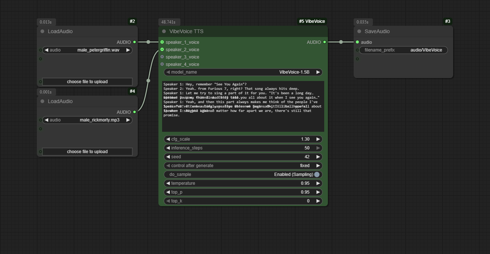

<!-- Improved compatibility of back to top link: See: https://github.com/othneildrew/Best-README-Template/pull/73 -->
<a id="readme-top"></a>

<div align="center">
  <h1 align="center">ComfyUI-VibeVoice</h1>



  <p align="center">
    A custom node for ComfyUI that integrates Microsoft's VibeVoice, a frontier model for generating expressive, long-form, multi-speaker conversational audio.
    <br />
    <br />
    <a href="https://github.com/wildminder/ComfyUI-VibeVoice/issues/new?labels=bug&template=bug-report---.md">Report Bug</a>
    ·
    <a href="https://github.com/wildminder/ComfyUI-VibeVoice/issues/new?labels=enhancement&template=feature-request---.md">Request Feature</a>

<!-- PROJECT SHIELDS -->
[![Stargazers][stars-shield]][stars-url]
[![Issues][issues-shield]][issues-url]
[![Contributors][contributors-shield]][contributors-url]
[![Forks][forks-shield]][forks-url]
  </p>
</div>


<!-- ABOUT THE PROJECT -->
## About The Project

This project brings the power of **VibeVoice** into the modular workflow of ComfyUI. VibeVoice is a novel framework by Microsoft for generating expressive, long-form, multi-speaker conversational audio. It excels at creating natural-sounding dialogue, podcasts, and more, with consistent voices for up to 4 speakers.

The custom node handles everything from model downloading and memory management to audio processing, allowing you to generate high-quality speech directly from a text script and reference audio files.

**✨ Key Features:**
*   **Multi-Speaker TTS:** Generate conversations with up to 4 distinct voices in a single audio output.
*   **Zero-Shot Voice Cloning:** Use any audio file (`.wav`, `.mp3`) as a reference for a speaker's voice.
*   **Advanced Attention Mechanisms:** Choose between `eager`, `sdpa`, `flash_attention_2`, and the new high-performance `sage` attention for fine-tuned control over speed, memory, and compatibility.
*   **Robust 4-Bit Quantization:** Run the large language model component in 4-bit mode to significantly reduce VRAM usage, with smart, stable configurations for all attention modes.
*   **Automatic Model Management:** Models are downloaded automatically and managed efficiently by ComfyUI to save VRAM.
*   **Fine-Grained Control:** Adjust parameters like CFG scale, temperature, and sampling methods to tune the performance and style of the generated speech.

<p align="right">(<a href="#readme-top">back to top</a>)</p>

<!-- GETTING STARTED -->
## 🚀 Getting Started

The node can be installed via **ComfyUI Manager:** Find `ComfyUI-VibeVoice` and click "Install".

Alternatively, install it manually:

1.  **Clone the Repository:**
    Navigate to your `ComfyUI/custom_nodes/` directory and clone this repository:
    ```sh
    git clone https://github.com/wildminder/ComfyUI-VibeVoice.git
    ```

2.  **Install Dependencies:**
    Open a terminal or command prompt, navigate into the cloned directory, and install the required Python packages. **For quantization support, ensure you install `bitsandbytes`**.
    ```sh
    cd ComfyUI-VibeVoice
    pip install -r requirements.txt
    ```

3.  **Optional: Install SageAttention**
    To enable the new `sage` attention mode, you must install the `sageattention` library in your ComfyUI Python environment. For Windows users, please refer to this [AI-windows-whl](https://github.com/wildminder/AI-windows-whl) for the required package.

    > **Note:** This is only required if you intend to use the `sage` attention mode.
  
3.  **Start/Restart ComfyUI:**
    Launch ComfyUI. The "VibeVoice TTS" node will appear under the `audio/tts` category. The first time you use the node, it will automatically download the selected model to your `ComfyUI/models/tts/VibeVoice/` folder.

## Models
| Model | Context Length | Generation Length |  Weight |
|-------|----------------|----------|----------|
| VibeVoice-1.5B | 64K | ~90 min | [HF link](https://huggingface.co/microsoft/VibeVoice-1.5B) |
| VibeVoice-Large| 32K | ~45 min | [HF link](https://huggingface.co/aoi-ot/VibeVoice-Large) |

<p align="right">(<a href="#readme-top">back to top</a>)</p>

<!-- USAGE EXAMPLES -->
## 🛠️ Usage

The node is designed to be intuitive within the ComfyUI workflow.

1.  **Add Nodes:** Add the `VibeVoice TTS` node to your graph. Use ComfyUI's built-in `Load Audio` node to load your reference voice files.
2.  **Connect Voices:** Connect the `AUDIO` output from each `Load Audio` node to the corresponding `speaker_*_voice` input on the VibeVoice TTS node.
3.  **Write Script:** In the `text` input, write your dialogue. Assign lines to speakers using the format `Speaker 1: ...`, `Speaker 2: ...`, etc., on separate lines.
4.  **Generate:** Queue the prompt. The node will process the script and generate a single audio file containing the full conversation.

> **Tip:** For a complete workflow, you can drag the example image from the `example_workflows` folder onto your ComfyUI canvas.

### Node Inputs

*   **`model_name`**: Select the VibeVoice model to use (`1.5B` or `Large`).
*   **`quantize_llm_4bit`**: **(Overhauled!)** Enable to run the LLM component in 4-bit (NF4) mode. This dramatically reduces VRAM usage.
*   **`attention_mode`**: **(New!)** Select the attention implementation: `eager` (safest), `sdpa` (balanced), `flash_attention_2` (fastest), or `sage` (quantized high-performance).
*   **`text`**: The conversational script. Lines must be prefixed with `Speaker <number>:` (e.g., `Speaker 1:`).
*   **`cfg_scale`**: Controls how strongly the model adheres to the reference voice's timbre.
*   **`inference_steps`**: Number of diffusion steps for the audio decoder.
*   **`seed`**: A seed for reproducibility.
*   **`do_sample`, `temperature`, `top_p`, `top_k`**: Standard sampling parameters for controlling the creativity and determinism of the speech generation.
*   **`force_offload`**: Forces the model to be completely offloaded from VRAM after generation.

<!-- PERFORMANCE SECTION -->
## ⚙️ Performance & Advanced Features

This update introduces a sophisticated system for managing performance, memory, and stability. The node will automatically select the best configuration based on your choices.

### Feature Compatibility & VRAM Matrix

| Quantize LLM | Attention Mode      | Behavior / Notes                                                                                                                                | Relative VRAM |
| :----------- | :------------------ | :---------------------------------------------------------------------------------------------------------------------------------------------- | :------------ |
| **OFF**      | `eager`             | Full Precision. Most compatible baseline.                                                                                                       | High          |
| **OFF**      | `sdpa`              | Full Precision. Recommended for balanced performance.                                                                                           | High          |
| **OFF**      | `flash_attention_2` | Full Precision. High performance on compatible GPUs.                                                                                            | High          |
| **OFF**      | `sage`              | Full Precision. Uses high-performance mixed-precision kernels.                                                                                  | High          |
| **ON**       | `eager`             | **Falls back to `sdpa`** with `bfloat16` compute. Warns user.                                                                                   | **Low**       |
| **ON**       | `sdpa`              | **Recommended for memory savings.** Uses `bfloat16` compute.                                                                                    | **Low**       |
| **ON**       | `flash_attention_2` | **Falls back to `sdpa`** with `bfloat16` compute. Warns user.                                                                                   | **Low**       |
| **ON**       | `sage`              | **Recommended for stability.** Uses `fp32` compute to ensure numerical stability with quantization, resulting in slightly higher VRAM usage.     | **Medium**    |


A key feature of this node is the optional **4-bit quantization** for the language model component. This is highly recommended for users with memory-constrained GPUs (e.g., <= 16GB VRAM) who wish to run the larger `VibeVoice-Large-pt` model.

**Benefits of `quantize_llm = Enabled`:**

| Model | Performance Impact | VRAM Savings |
|---|---|---|
| **VibeVoice-Large (7B)** | **~8.5x faster** inference | Saves **>4.4 GB** (over 36%) |
| **VibeVoice-1.5B** | ~1.5x slower inference | Saves **~5.5 GB** (over 63%) |

As shown, quantization provides a massive speedup and VRAM reduction for the 7B model, making it accessible on a wider range of hardware. While it slightly slows down the 1.5B model, the significant VRAM savings may still be beneficial for complex workflows.

*\*Note: `flash_attention_2` with Q4 automatically falls back to `sdpa`.*

<!-- CHANGELOG -->
## Changelog

<details>
<summary><strong>v1.3.0 - SageAttention & Quantization Overhaul</strong></summary>

### ✨ New Features
*   **SageAttention Support:** Full integration with the `sageattention` library for a high-performance, mixed-precision attention option.
*   **Robust 4-Bit LLM Quantization:** The "Quantize LLM (4-bit)" option is now highly stable and delivers significant VRAM savings.
*   **Smart Configuration & Fallbacks:** The node now automatically handles incompatible settings (e.g., 4-bit with `flash_attention_2`) by gracefully falling back to a stable alternative (`sdpa`) and notifying the user.

### 🐛 Bug Fixes & Stability Improvements
*   **Fixed SageAttention Crashes** 
*   **Fixed Numerical Instability (`NaN`/`Inf` Errors)**
*   **Resolved All `dtype` Mismatches**
*   **Corrected SageAttention Kernel Assertions**
*   **Addressed Deprecation Warning**
</details>

<details>
<summary><strong>v1.2.0 - Compatibility Update</strong></summary>

### ✅ Compatibility
*   **Transformers Library:** Includes automatic detection and compatibility for both older and newer versions of the Transformers library (pre- and post-4.56).

### 🐛 Bug Fixes
*   **Force Offload:** Resolved an `AttributeError` to ensure the force offload option works correctly with all versions of ComfyUI.
*   **Multi-Speaker DynamicCache:** Fixed a `'DynamicCache' object has no attribute 'key_cache'` error when using multiple speakers with newer versions of the Transformers library.
</details>

<p align="right">(<a href="#readme-top">back to top</a>)</p>

### Tips from the Original Authors

*   **Punctuation:** For Chinese text, using English punctuation (commas and periods) can improve stability.
*   **Model Choice:** The 7B model variant (`VibeVoice-Large`) is generally more stable.
*   **Spontaneous Sounds/Music:** The model may spontaneously generate background music, especially if the reference audio contains it or if the text includes introductory phrases like "Welcome to...". This is an emergent capability and cannot be directly controlled.
*   **Singing:** The model was not trained on singing data, but it may attempt to sing as an emergent behavior. Results may vary.

<p align="right">(<a href="#readme-top">back to top</a>)</p>

<!-- LICENSE -->
## License

This project is distributed under the MIT License. See `LICENSE.txt` for more information. The VibeVoice model and its components are subject to the licenses provided by Microsoft. Please use responsibly.

<p align="right">(<a href="#readme-top">back to top</a>)</p>

<!-- ACKNOWLEDGMENTS -->
## Acknowledgments

*   **Microsoft** for creating and open-sourcing the [VibeVoice](https://github.com/microsoft/VibeVoice) project.
*   **The ComfyUI team** for their incredible and extensible platform.

<p align="right">(<a href="#readme-top">back to top</a>)</p>

## Star History

[](https://www.star-history.com/#wildminder/ComfyUI-VibeVoice&Timeline)


<!-- MARKDOWN LINKS & IMAGES -->
[contributors-shield]: https://img.shields.io/github/contributors/wildminder/ComfyUI-VibeVoice.svg?style=for-the-badge
[contributors-url]: https://github.com/wildminder/ComfyUI-VibeVoice/graphs/contributors
[forks-shield]: https://img.shields.io/github/forks/wildminder/ComfyUI-VibeVoice.svg?style=for-the-badge
[forks-url]: https://github.com/wildminder/ComfyUI-VibeVoice/network/members
[stars-shield]: https://img.shields.io/github/stars/wildminder/ComfyUI-VibeVoice.svg?style=for-the-badge
[stars-url]: https://github.com/wildminder/ComfyUI-VibeVoice/stargazers
[issues-shield]: https://img.shields.io/github/issues/wildminder/ComfyUI-VibeVoice.svg?style=for-the-badge
[issues-url]: https://github.com/wildminder/ComfyUI-VibeVoice/issues
