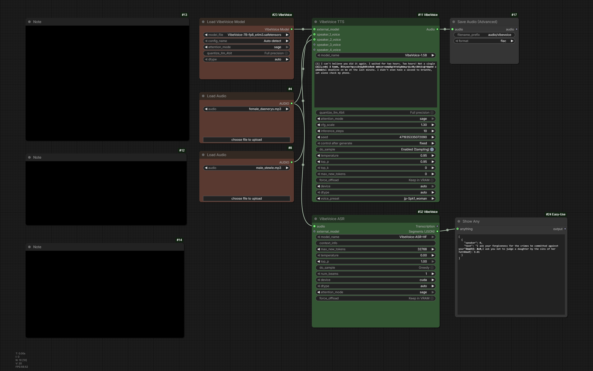

<!-- Improved compatibility of back to top link: See: https://github.com/othneildrew/Best-README-Template/pull/73 -->
<a id="readme-top"></a>

<div align="center">
  <h1 align="center">ComfyUI-VibeVoice</h1>


  <p align="center">
    A custom node for ComfyUI that integrates Microsoft's VibeVoice, a frontier model for generating expressive, long-form, multi-speaker conversational audio.
    <br />
    <br />
    <a href="https://github.com/wildminder/ComfyUI-VibeVoice/issues/new?labels=bug&template=bug-report---.md">Report Bug</a>
    ·
    <a href="https://github.com/wildminder/ComfyUI-VibeVoice/issues/new?labels=enhancement&template=feature-request---.md">Request Feature</a>

<!-- PROJECT SHIELDS -->
[![Stargazers][stars-shield]][stars-url]
[![Issues][issues-shield]][issues-url]
[![Contributors][contributors-shield]][contributors-url]
[![Forks][forks-shield]][forks-url]
  </p>
</div>


<!-- ABOUT THE PROJECT -->
## About The Project

VibeVoice is a novel framework by Microsoft for generating expressive, long-form, multi-speaker conversational audio. It excels at creating natural-sounding dialogue, podcasts, and more, with consistent voices for up to 4 speakers.

<div align="center">
      
  </div>

The custom node handles everything from model downloading and memory management to audio processing, allowing you to generate high-quality speech directly from a text script and reference audio files.

**✨ Key Features:**
*   **Multi-Speaker TTS:** Generate conversations with up to 4 distinct voices in a single audio output.
*   **High-Fidelity Voice Cloning:** Use any audio file (`.wav`, `.mp3`) as a reference for a speaker's voice.
*   **Hybrid Voice Cloning:** Mix and match cloned speakers in the same script — at least one `speaker_*_voice` reference audio is required; other speakers are cloned from the provided reference(s).
*   **Flexible Scripting:** Use simple `[1]` tags or the classic `Speaker 1:` format to write your dialogue.
*   **Advanced Attention Mechanisms:** Choose between `eager`, `sdpa`, `flash_attention_2`, and the high-performance `sage` attention for fine-tuned control over speed and compatibility.
*   **Robust 4-Bit Quantization:** Run the large language model component in 4-bit mode to significantly reduce VRAM usage.
*   **Automatic Model Management:** Models are downloaded automatically and managed efficiently by ComfyUI to save VRAM.

<p align="right">(<a href="#readme-top">back to top</a>)</p>

<!-- GETTING STARTED -->
## 🚀 Getting Started

The easiest way to install is through the **ComfyUI Manager:**
1.  Go to `Manager` -> `Install Custom Nodes`.
2.  Search for `ComfyUI-VibeVoice` and click "Install".
3.  Restart ComfyUI.

Alternatively, to install manually:

1.  **Clone the Repository:**
    Navigate to your `ComfyUI/custom_nodes/` directory and clone this repository:
    ```sh
    git clone https://github.com/wildminder/ComfyUI-VibeVoice.git
    ```

2.  **Install Dependencies:**
    Open a terminal or command prompt, navigate into the cloned directory, and install the required Python packages. **For quantization support, you must install `bitsandbytes`**.
    ```sh
    cd ComfyUI-VibeVoice
    pip install -r requirements.txt
    ```

3.  **Optional: Install SageAttention**
    To enable the `sage` attention mode, you must install the `sageattention` library. For Windows users, a pre-compiled wheel is available at [AI-windows-whl](https://github.com/wildminder/AI-windows-whl).
    > **Note:** This is only required if you intend to use the `sage` attention mode.

> **Audio backend:** Audio resampling uses **`torchaudio`** (the ComfyUI-core idiom) as the primary
> library; file decoding uses **PyAV** (`av`, bundled with ComfyUI) with `soundfile` as fallback.
> **`librosa` is not required** — it is only an optional last-resort fallback, and the node
> degrades gracefully when it (or `scipy`) is absent. To install the optional fallbacks:
> `pip install scipy librosa` (or `pip install ComfyUI-VibeVoice[audio-extra]`).

4.  **Start/Restart ComfyUI:**
    Launch ComfyUI. The "VibeVoice TTS" node will appear under the `audio/tts` category. The first time you use the node, it will automatically download the selected model to your `ComfyUI/models/tts/VibeVoice/` folder.

## Models
| Model | Context Length | Generation Length |  Weight |
|-------|----------------|----------|----------|
| VibeVoice-1.5B | 64K | ~90 min | [HF link](https://huggingface.co/microsoft/VibeVoice-1.5B) |
| VibeVoice-Large| 32K | ~45 min | [HF link](https://huggingface.co/aoi-ot/VibeVoice-Large) |

<p align="right">(<a href="#readme-top">back to top</a>)</p>

<!-- USAGE EXAMPLES -->
## 🛠️ Usage

The node is designed for maximum flexibility within your ComfyUI workflow.

1.  **Add Nodes:** Add the `VibeVoice TTS` node to your graph. Use ComfyUI's built-in `Load Audio` node to load your reference voice files.
2.  **Connect Voices (Optional):** Connect the `AUDIO` output from each `Load Audio` node to the corresponding `speaker_*_voice` input.
3.  **Write Your Script:** In the `text` input, write your dialogue using one of the supported formats.
4.  **Generate:** Queue the prompt. The node will process the script and generate a single audio file containing the full conversation.

> **Tip:** For a complete workflow, you can drag the example image from the `example_workflows` folder onto your ComfyUI canvas.

### Scripting and Voice Modes

#### Speaker Tagging
You can assign lines to speakers in two ways. Both are treated identically.

*   **Modern Format (Recommended):** `[1] This is the first speaker.`
*   **Classic Format:** `Speaker 1: This is the first speaker.`

You can also add an optional colon to the modern format (e.g., `[1]: ...`). The node handles all variations consistently.

#### Hybrid Voice Generation
This is a powerful feature that lets you mix cloned voices in the same script. **At least one `speaker_*_voice` reference audio is required** — VibeVoice anchors the timbre of every speaker to a provided reference, so you cannot generate a fully reference-free ("zero-shot") voice for any speaker.

*   **To Clone a Voice:** Connect a `Load Audio` node to the speaker's input (e.g., `speaker_1_voice`).
*   **To Reuse a Cloned Voice:** Any other speaker may be left empty. When a speaker has no reference, its voice is cloned from the provided reference(s) rather than generated from scratch.

**Example Hybrid Script:**
```
[1] This line will use the audio from speaker_1_voice.
[2] This line will reuse the cloned voice from speaker 1.
[1] I'm back with my cloned voice.
```
In this example, you would connect an audio source to `speaker_1_voice`; speakers `[2]` are cloned from it.

### Node Inputs

*   **`model_name`**: Select the VibeVoice model to use (`1.5B` or `Large`).
*   **`text`**: The conversational script. See "Scripting and Voice Modes" above for formatting.
*   **`quantize_llm_4bit`**: Enable to run the LLM component in 4-bit (NF4) mode, dramatically reducing VRAM usage.
*   **`attention_mode`**: Select the attention implementation: `eager` (safest), `sdpa` (balanced), `flash_attention_2` (fastest), or `sage` (quantized high-performance).
*   **`cfg_scale`**: Controls how strongly the model adheres to the reference voice's timbre. Higher values are stricter. Recommended: `1.3`.
*   **`inference_steps`**: Number of diffusion steps for audio generation. Recommended: `10`.
*   **`seed`**: A seed for reproducibility. Set to 0 for a random seed on each run.
*   **`do_sample`, `temperature`, `top_p`, `top_k`**: Standard sampling parameters for controlling the creativity and determinism of the speech generation.
*   **`force_offload`**: Forces the model to be completely offloaded from VRAM after generation.

### Loading External Models

By default the nodes download / load official VibeVoice checkpoints from the `models/tts/VibeVoice` folder. You can instead load **any VibeVoice weight file you already have on disk** (safetensors / `.bin` / `.gguf`) via the dedicated **`Load VibeVoice Model`** node, which outputs a `VIBEVOICE_MODEL` that plugs into the optional `external_model` input of the **TTS**, **Realtime TTS**, and **ASR** nodes.

**Setup:**

1.  Place your VibeVoice weight file in ComfyUI's `models/diffusion_models/` (a.k.a. `models/unet/`) folder.
2.  *(Optional but recommended)* Place sidecar JSON files next to the weight file to bind the architecture config, audio preprocessor, and tokenizer:
    *   `<weight_file>.config.json` — architecture config (preferred), or a `config.json` in the same directory.
    *   `<weight_file>.preprocessor.json` — audio preprocessor config (preferred), or a `preprocessor_config.json` in the same directory.
    *   `tokenizer.json` — Qwen2.5 text tokenizer (same directory). Falls back to the packaged tokenizer or a HuggingFace download if absent.
3.  Add the **`Load VibeVoice Model`** node, select your file in `model_file`, and pick the matching architecture in `config_name` (`VibeVoice-1.5B`, `VibeVoice-Large`, `VibeVoice-Realtime-0.5B`, or `VibeVoice-ASR`). When no sidecar config is present, `config_name` selects the packaged default config (available for `1.5B` and `Large`).
4.  Connect the node's `VIBEVOICE_MODEL` output to the `external_model` input of the TTS / Realtime TTS / ASR node. When connected, `external_model` **overrides** the `model_name` dropdown.

**Notes:**

*   The model is built entirely on **CPU**; the single host-to-device transfer is owned by ComfyUI's VRAM arbitration (same contract as the standard loader path).
*   Type guards prevent mis-wiring: a streaming model on the TTS node, a TTS model on the ASR node, etc. raise a clear error pointing to the correct node.
*   4-bit LLM quantization (`quantize_llm_4bit`) applies to TTS / Realtime models only; ASR models are always loaded at full precision.

<!-- PERFORMANCE SECTION -->
## ⚙️ Performance & Advanced Features

This node features a sophisticated system for managing performance, memory, and stability.

### Feature Compatibility & VRAM Matrix

| Quantize LLM | Attention Mode      | Behavior / Notes                                                                                                                                | Relative VRAM |
| :----------- | :------------------ | :---------------------------------------------------------------------------------------------------------------------------------------------- | :------------ |
| **OFF**      | `eager`             | Full Precision. Most compatible baseline.                                                                                                       | High          |
| **OFF**      | `sdpa`              | Full Precision. Recommended for balanced performance.                                                                                           | High          |
| **OFF**      | `flash_attention_2` | Full Precision. High performance on compatible GPUs.                                                                                            | High          |
| **OFF**      | `sage`              | Full Precision. Uses high-performance mixed-precision kernels.                                                                                  | High          |
| **ON**       | `eager`             | **Falls back to `sdpa`** with `bfloat16` compute. Warns user.                                                                                   | **Low**       |
| **ON**       | `sdpa`              | **Recommended for memory savings.** Uses `bfloat16` compute.                                                                                    | **Low**       |
| **ON**       | `flash_attention_2` | **Falls back to `sdpa`** with `bfloat16` compute. Warns user.                                                                                   | **Low**       |
| **ON**       | `sage`              | **Recommended for stability.** Uses `fp32` compute to ensure numerical stability with quantization, resulting in slightly higher VRAM usage.     | **Medium**    |


<!-- CHANGELOG -->
## Changelog

<details open>
<summary><strong>v2.2.0 - External Model Input (Load Your Own Weights)</strong></summary>

### ✨ Highlights
*   **New `VibeVoiceLoadExternalModel` node:** load a VibeVoice checkpoint from your own
    `.safetensors`/`.pt` file in `models/diffusion_models` (or `models/unet`) instead of the
    built-in HuggingFace download path. ComfyUI's stock `Load Diffusion Model` cannot parse
    VibeVoice weights, so this node provides a dedicated `VIBEVOICE_MODEL` output type.
*   **Optional `external_model` input on all three nodes:** TTS, Realtime TTS, and ASR now accept
    an externally loaded model bundle. When wired, the node skips its own loader entirely and uses
    the provided model/processor.
*   **Sidecar config binding:** the loader resolves architecture config via a sidecar
    `<weight>.config.json` (or a `config.json` next to the file), falling back to the packaged
    default for the selected `config_name`. Optional `<weight>.preprocessor.json` and a local
    `tokenizer.json` are honored as well.
*   **Type guards:** each node rejects mismatched model kinds with a clear error (e.g. a Realtime
    model into the TTS node, an ASR model into TTS, a non-streaming model into Realtime).

### 🔧 Changes
*   New `modules/custom_types.py`: `VibeVoiceModel = io.Custom("VIBEVOICE_MODEL")`.
*   New `modules/external_loader.py`: sidecar resolution + `load_external_vibevoice_model()`
    (TTS/streaming) and `load_external_vibevoice_asr_model()` (ASR) — CPU-first load, in-memory
    state-dict injection, dtype cast, optional 4-bit quantization (TTS only) and SageAttention.
*   New `nodes/external_loader_node.py`: the loader node (registered in `vibevoice_nodes.py`).
*   `modules/generation.py`: `ExternalVibeVoiceModelHandler` + `load_vibevoice_from_external()`.
*   `modules/asr_generation.py`: `ExternalVibeVoiceASRModelHandler` + `load_asr_from_external()`.
*   `nodes/tts_node.py`, `nodes/realtime_node.py`, `nodes/asr_node.py`: optional `external_model`
    input, early validation pass-through, and execute-branch routing with kind guards.

### 🧪 Tests
*   New `tests/test_custom_types.py` (5), `tests/test_external_loader.py` (39),
    `tests/test_external_loader_node.py` (13).
*   Extended `tests/test_node_schema.py`, `tests/test_generation.py` (+15),
    `tests/test_asr_generation.py` (+16), `tests/test_realtime_node.py` (+7),
    `tests/test_asr_node.py`, `tests/test_patcher_behavioral.py`, `tests/test_integration.py`,
    `tests/test_docs_consistency.py` (+3), `tests/test_workflow.py` (+5), `tests/test_imports.py`.

</details>

<details>
<summary><strong>v2.1.1 - Standard ComfyUI Progress Bar During Inference</strong></summary>

### ✨ Highlights
*   **Live progress bar:** All three nodes (TTS, Realtime TTS, ASR) now drive the standard
    ComfyUI frontend progress bar during inference. Previously the bar sat at 0% for the whole
    generation and jumped to 100% only at the end.
*   **Responsive cancel:** the progress hook checks ComfyUI's interrupt flag on every loop step,
    so pressing cancel stops generation promptly instead of waiting for the current blocking call.
*   **Guaranteed 100%:** a final progress event is always emitted, even when generation stops
    early (EOS) or raises.

### 🔧 Changes
*   Vendored `generate()` (non-streaming + streaming) gained an optional, framework-agnostic
    `progress_callback(current, total)` hook fired once per AR loop step (vendored code stays
    `comfy`-free; `None` = disabled, fully backward compatible).
*   `modules/generation.py`: `generate_audio()` / `generate_streaming_audio()` wrap the hook with
    `comfy.utils.ProgressBar` (throttled WebSocket updates; the bar total self-corrects via
    `update_absolute(value, total=...)` once the loop reports its real budget).
*   `modules/asr_generation.py`: ASR reports per-token progress through an HF `BaseStreamer`
    (greedy/sampling only; beam search falls back to a single 0→100% bar).

### 🧪 Tests
*   New `tests/test_generate_progress_callback.py` (5 tests) and
    `tests/test_streaming_progress_callback.py` (4 tests): drive the real vendored loops with
    scripted mocks and lock the callback contract (monotonic, bounded, call counts, interrupt
    propagation, output determinism).
*   New `tests/test_streaming_progress.py` (4 tests); extended `tests/test_generation.py` (+5),
    `tests/test_asr_generation.py` (+6), `tests/test_integration.py` (+3 node-level tests).

</details>

<details>
<summary><strong>v2.1.0 - torchaudio-Primary Audio Backend (librosa now optional)</strong></summary>

### ✨ Highlights
*   **torchaudio is now the primary audio library.** Resampling uses `torchaudio.functional.resample`
    (Kaiser-windowed sinc — the same family ComfyUI core uses), matching the ComfyUI-core idiom.
*   **`librosa` is no longer a hard dependency.** It was declared but never actually imported
    (a phantom dependency). It is now an *optional* last-resort fallback; the node never crashes
    when librosa (or scipy) is missing or broken (e.g. the empty librosa namespace stub shipped in
    some embedded Pythons).
*   **ComfyUI built-ins adopted:** file decoding now uses PyAV (`av`) — ComfyUI's own audio decoder —
    with `soundfile`/`torchaudio`/`librosa` as guarded fallbacks. This also fixes `.m4a`/`.ogg`
    reference-audio loading, which `soundfile` (libsndfile) cannot decode.
*   **Dependency surface minimized:** `librosa` and `scipy` moved to the optional
    `[audio-extra]` group; `torchaudio` + `soundfile` remain the working default.

### 🔧 Changes
*   New `modules/audio_backend.py`: single dependency-resilient backend for resample / load / save
    with import-time capability detection (`_HAS_*` flags) and graceful fallback ordering.
*   `modules/audio_utils.py`: `resample_audio()` delegates to the backend; `preprocess_comfy_audio()`
    now resamples in tensor space (no numpy round-trip).
*   Vendored processors (`_load_audio_from_path`, `save_audio`, ASR file loading) route through the
    backend; no hard `ffmpeg`/`soundfile` requirement for the common wav/flac path.

### 🧪 Tests
*   New `tests/test_audio_backend.py` (41 tests): import resilience with any optional lib blocked,
    resample correctness/priority/fallbacks, numpy↔tensor parity, file I/O roundtrips, `f32_pcm`.
*   New `tests/test_processor_io_backend.py` (17 tests): real vendored processor I/O via the backend.
*   Extended `tests/test_audio_utils.py`, `tests/test_pyproject.py`, `tests/test_imports.py`.

</details>

<details>
<summary><strong>v2.0.2 - Negative-Branch RoPE Position Fix (SDPA Shape Crash)</strong></summary>

### 🐛 Fixes
*   **BUG-011 — Negative-branch RoPE `position_ids` desync:** Fixed a `RuntimeError: Expected size for first two dimensions of batch2 tensor to be: [12, 3] but got: [12, 2]` crash during TTS generation. In the non-streaming `generate()` CFG loop, the negative (unconditional) forward fed a **single-token** `inputs_embeds` `(B,1,H)` together with a **full-length** `position_ids` `(B, step+1)`. In transformers 5.x the explicit `position_ids` drive RoPE directly, so q/k silently broadcast against full-length cos/sin and expanded to seq-len `step+1` while v (never rotated) stayed length 1 — the KV cache accumulated `step+1` keys but only 1 value per step, and SDPA's `attn @ value` crashed at AR step 1. The negative forward now passes **current-only** `position_ids` (`neg_position_ids[:, -1:]`), matching its single input token; the attention mask stays full-length.

### 🧪 Tests
*   New `tests/test_generate_neg_position_ids.py` (4 tests): drives the real `generate()` through several AR steps with a recording inner LM and locks the invariant that `position_ids` length always equals `inputs_embeds` sequence length (red/green verified against the buggy code).

</details>

<details>
<summary><strong>v2.0.1 - CPU-First Model Loading (VRAM Round-Trip Fix)</strong></summary>

### 🐛 Fixes
*   **Load Device Flow — DF-001..DF-006:** Fixed a GPU→RAM→GPU round-trip during model loading. Previously the checkpoint state dict was loaded directly onto CUDA (a full-model VRAM spike outside ComfyUI's arbitration), copied back to CPU-resident parameters, then moved to CUDA again. Now the loader builds the model **entirely on CPU** (state dict, `load_state_dict`, dtype cast, and 4-bit quantization all on CPU), and `VibeVoicePatcher.patch_model` owns the **single** host-to-device transfer after ComfyUI's `load_models_gpu` VRAM arbitration. Peak VRAM during load drops from ≈2× model size to ≈1× model size.
*   **Dtype Threading — DF-004 / AUD-008:** The user-selected dtype is now threaded from the node through the handler into the loader and applied on CPU before the transfer; the patcher's dtype cast is now a mismatch-only guard (no redundant GPU cast).
*   **Handler No-Move — DF-003:** `VibeVoiceModelHandler.load_model` no longer moves the model; device placement is owned solely by the patcher.

### 🧪 Tests
*   New `tests/test_load_device_flow.py` (36 tests): device-ledger doubles asserting CPU-only loading, single H2D transfer, no round-trip, dtype threading, cast guard, VRAM arbitration, and a `[GPU-OPTIONAL]` peak-VRAM measurement.

</details>

<details>
<summary><strong>v2.0.0 - V3 Extension &amp; VRAM Parity</strong></summary>

### ✨ Highlights
*   **V3 Extension API:** Migrated the custom-node entrypoint to the ComfyUI V3 `ComfyExtension` / `io.ComfyNode` schema — type-filtered model dropdowns and declarative inputs/outputs.
*   **VRAM Parity (ASR) — CRIT-001:** The ASR path now runs under the same `VibeVoicePatcher` / `model_management.load_model_gpu` orchestration as TTS, clearing the dedicated ASR cache on unload.
*   **Warm Re-attach — NTH-004:** `force_offload` can retain model tensors on the intermediate device for a fast re-attach on the next run instead of reloading from disk.
*   **Streaming TTS Node — NTH-001:** `VibeVoice-Realtime-0.5B` is now reachable through a dedicated `VibeVoice Realtime TTS` node that shares the patcher / attention machinery.
*   **Maintainability — IMP-004:** TTS/ASR download, discovery, and sharded-load logic is now shared via `BaseVibeVoiceLoader`.
*   **Device &amp; Attention Honesty — IMP-003 / IMP-001:** MPS/XPU/NPU device selection is honored when available; `flash_attention_2` is only offered when `flash-attn` + CUDA are present.
*   **Docs Consistency — CRIT-003:** README zero-shot wording now matches `generate_audio` (at least one reference voice is required).

</details>

<details>
<summary><strong>v1.5.0 - Stability and Prompting</strong></summary>

### ✨ New Features & Improvements
*   **Total Generation Stability:** Fixed the bug where a speaker's voice could unintentionally change or blend with another reference voice mid-sentence.
*   **Improved Voice Cloning Fidelity** 
*   **Consistent Speaker Tagging:** The node now intelligently handles multiple script formats (`[1]`, `[1]:`, and `Speaker 1:`) to produce identical, high-quality results, removing all previous inconsistencies.
*   **Hybrid Voice Cloning:** Mix and match cloned speakers in the same script — at least one reference audio is required; speakers without their own reference are cloned from the provided reference(s).
</details>

<details>
<summary><strong>v1.3.0 - SageAttention & Quantization Overhaul</strong></summary>

*   **SageAttention Support:** Full integration with the `sageattention` library for a high-performance, mixed-precision attention option.
*   **Robust 4-Bit LLM Quantization:** The "Quantize LLM (4-bit)" option is now highly stable and delivers significant VRAM savings.
*   **Smart Configuration & Fallbacks:** The node now automatically handles incompatible settings (e.g., 4-bit with `flash_attention_2`) by gracefully falling back to a stable alternative (`sdpa`) and notifying the user.
</details>

<details>
<summary><strong>v1.2.0 - Compatibility Update</strong></summary>

*   **Transformers Library:** Includes automatic detection and compatibility for both older and newer versions of the Transformers library (pre- and post-4.56).
*   **Bug Fixes:** Resolved issues with `Force Offload` and multi-speaker generation on newer Transformers versions.
</details>

<p align="right">(<a href="#readme-top">back to top</a>)</p>

### Tips from the Original Authors

*   **Punctuation:** For Chinese text, using English punctuation (commas and periods) can improve stability.
*   **Model Choice:** The 7B model variant (`VibeVoice-Large`) is generally more stable.
*   **Spontaneous Sounds/Music:** The model may spontaneously generate background music, especially if the reference audio contains it or if the text includes introductory phrases like "Welcome to...". This is an emergent capability and cannot be directly controlled.
*   **Singing:** The model was not trained on singing data, but it may attempt to sing as an emergent behavior. Results may vary.

<p align="right">(<a href="#readme-top">back to top</a>)</p>

<!-- LICENSE -->
## License

This project is distributed under the MIT License. See `LICENSE.txt` for more information. The VibeVoice model and its components are subject to the licenses provided by Microsoft. Please use responsibly.

<p align="right">(<a href="#readme-top">back to top</a>)</p>

<!-- ACKNOWLEDGMENTS -->
## Acknowledgments

*   **Microsoft** for creating and open-sourcing the [VibeVoice](https://github.com/microsoft/VibeVoice) project.
*   **The ComfyUI team** for their incredible and extensible platform.

<p align="right">(<a href="#readme-top">back to top</a>)</p>

## Star History

[](https://www.star-history.com/#wildminder/ComfyUI-VibeVoice&Timeline)


<!-- MARKDOWN LINKS & IMAGES -->
[contributors-shield]: https://img.shields.io/github/contributors/wildminder/ComfyUI-VibeVoice.svg?style=for-the-badge
[contributors-url]: https://github.com/wildminder/ComfyUI-VibeVoice/graphs/contributors
[forks-shield]: https://img.shields.io/github/forks/wildminder/ComfyUI-VibeVoice.svg?style=for-the-badge
[forks-url]: https://github.com/wildminder/ComfyUI-VibeVoice/network/members
[stars-shield]: https://img.shields.io/github/stars/wildminder/ComfyUI-VibeVoice.svg?style=for-the-badge
[stars-url]: https://github.com/wildminder/ComfyUI-VibeVoice/stargazers
[issues-shield]: https://img.shields.io/github/issues/wildminder/ComfyUI-VibeVoice.svg?style=for-the-badge
[issues-url]: https://github.com/wildminder/ComfyUI-VibeVoice/issues
